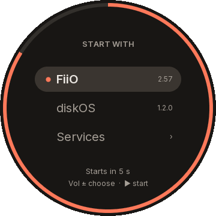
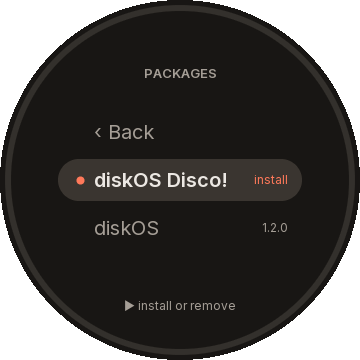

# SNOWSKY DISC boot layer

**A small base layer for your SNOWSKY DISC: it lets the player run new
interfaces and services next to FiiO's own software, installs them from the
memory card, and always lets you go back.**

An unofficial project, not affiliated with FiiO or SNOWSKY. Installing it
writes the player's system memory over USB; read [the risk](docs/install.md#the-risk) and
[the way back](docs/way-back.md) before you start.

[What you get](#what-you-get) · [Install](#install) ·
[Installation guide](docs/install.md) · [The way back](docs/way-back.md) ·
[The keys at power-on](#the-keys-at-power-on) ·
[Changelog](CHANGELOG.md) · [Releases](https://github.com/eudj1n/snowsky-disc-boot/releases)

<p align="center">
  
  &nbsp;&nbsp;
  
</p>

_The boot menu, drawn by its own code: choosing the interface at power-on,
and its packages, from the card or installed._

## What you get

| | |
| --- | --- |
| **FiiO's player, unchanged** | The image keeps FiiO's own system and adds only the boot layer; music, settings and the library stay as they are. |
| **Packages from the card** | Interfaces, a menu and services come as packages on the memory card; the boot menu installs them (the first time, a start with Play), each checked before it runs. |
| **The boot menu** | At power-on the player asks which interface to start, FiiO's own among them. Its Services screen turns each service on or off; its Packages screen installs what waits on the card and removes an interface, a service or everything of ours. |
| **[DISC server](https://github.com/eudj1n/snowsky-disc-server)** | Offered by default: the player serves [Disc Player](https://github.com/eudj1n/snowsky-disc-player) and other web apps over its Wi-Fi. |
| **Health journal** | Offered by default: disc-health notes the battery and its temperature, free space, card errors and crashes every 10 minutes, offline, for the server's diagnostics. |
| **Several Wi-Fi networks** | Offered by default: disc-network remembers up to 8 networks the player joined; when the one FiiO's interface keeps is out of reach, it puts a remembered one in range in its place, so the player joins it without the password again. |
| **Updates without USB Boot** | `install.py --packages` puts new versions of the packages on the card; the boot menu installs them. |
| **Safe starts** | A package that fails at its start gives way to the previous one by itself; three failed starts in a row bring FiiO's interface back. |
| **A way back, always** | FiiO's own update, or the installer through USB Boot, returns the player to stock. |

## Install

1. Check that the player runs FiiO's firmware **2.57** and that this computer
   (macOS or Linux) has Python 3.11 or later, libusb, squashfs-tools 4.6 or
   later and openssl; have FiiO's 2.57 update unpacked.
2. Download `disc-installer-<version>.tar.gz` from the
   [latest release](https://github.com/eudj1n/snowsky-disc-boot/releases),
   unpack it and, in a terminal, in its folder:

   ```sh
   python3 install.py
   ```

3. Follow it: it builds the new system, puts the packages on the card and
   writes the player through USB Boot, about 15 minutes with the player.

The [installation guide](docs/install.md) explains each step, what is
installed and the risk; [back to stock](docs/way-back.md) explains how to
return.

## The keys at power-on

| Held at power-on | What starts |
| --- | --- |
| Nothing | The boot layer with your packages (the menu asks when there is a choice) |
| Volume Up | FiiO's own interface, no package started, for this start only |
| Play | The installation of the packages staged on the card, then the boot layer |
| Volume Down, with the cable to a computer | USB Boot, for the installer |

## For developers

How the layer works, how to build, test and release it:
[development](docs/dev/development.md), the [contract](docs/dev/boot/contract.md) the
packages rely on, and the [plan](docs/dev/plan.md).

License: MIT (see [LICENSE](LICENSE)).
