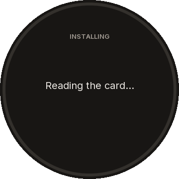
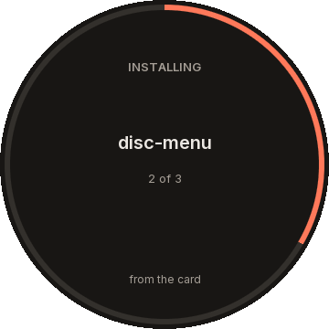
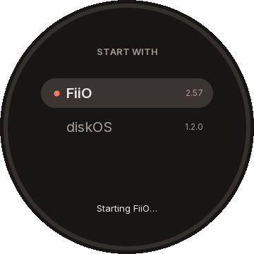

# Development

## Layout

| Path | What |
| --- | --- |
| `README.md`, `CHANGELOG.md`, `docs/install.md`, `docs/way-back.md` | For users (the installer's archive carries them, with `docs/assets/`) |
| `docs/dev/contract.md` | The boot layer's contract with packages |
| `docs/dev/plan.md` | The canonical plan |
| `docs/dev/` | For developers: this page, the contract, the plan, reviews, transports and procedures |
| `docs/dev/observations/` | The records of sessions on players (writes, readbacks, boot evidence) |
| `device/boot/boot.c` | `disc-boot`: modes, the service's supervisor, requests, recovery, the `mq_ui` launcher |
| `device/common/` | What the programs share: package manifests and verification (`manifest.c`), files, JSON and state (`boot_util.c`), SHA-256 (`sha256.c`) |
| `device/vendor/jsmn/` | The JSON tokenizer (MIT, pinned) |
| `device/menu/` | `disc-menu`, the boot menu package: the screen (`draw.c`), the list, keys and touch, the hand-over (`menu.c`) and its font (`font.h`, generated) |
| `scripts/menu_font.py` | Rasterises Inter into `device/menu/font.h` (the toolchain has no font rasteriser) |
| `console.py` | The player's USB console: commands, a shell, a file to `/tmp`, a read-only summary |
| `install.py`, `scripts/installer/` | The guided installer: the terminal look in the menu's colours (`tui.py`), the card (`card.py`), the steps (`flow.py`) |
| `catalog/packages.json`, `scripts/catalog.py` | The packages the installer offers, and their checks and fetching |
| `device/console/usb_console.c` | `disc-usb-console`, the USB ACM engineering console |
| `device/usbboot/` | The programs the installer runs from the player's RAM in USB Boot: the NAND reader, the SFC identity, the batches, the read by digest, the staging check |
| `device/scripts/boot-report.sh` | The boot report written to the card (in the image) |
| `device/scripts/card-guard.sh` | The card guard, `rm` first in the `PATH` of stock's player and UI (in the image) |
| `device/tests/`, `device/Makefile`, `device/Dockerfile.toolchain` | The C tests, the build and the cross toolchain's recipe |
| `scripts/package.py` | Packages: describe a folder, check it as `disc-boot` does, zip it, stage it on a card |
| `scripts/deployment/build_candidate.py` | The image builder (variant `boot`): stock plus the boot layer, verified offline |
| `scripts/deployment/` | Reviews, transports, readback and audits of a USB Boot installation |
| `tests/integration/` | Checks run in the disposable container ([build and flash](build-and-flash.md)) |
| `scripts/firmware_profile.py`, `firmware/` | Reviewed firmware profiles (V2.57) |
| `tests/conformance/` | Synthetic tests, runnable without firmware or a player |

## Build and test

```sh
bash scripts/test.sh          # host build of the console and NAND tests, then every conformance test
bash scripts/build.sh host    # host build only
```

The player's binaries need the pinned soft-float toolchain (Docker):

```sh
docker build --platform linux/amd64 -t disc-native-toolchain -f device/Dockerfile.toolchain .
bash scripts/build.sh mips     # the console, static and soft-float
bash scripts/build.sh reader   # the NAND reader's MIPS tests and freestanding core
```

`DISC_TOOLCHAIN_IMAGE=<image>` selects a reviewed copy of the toolchain image. Its recipe
pins the Debian base by digest and the musl.cc compiler by SHA-256, and `disc-boot` carries
as its build id the last commit that changed its sources (`device/boot`, `device/console`,
`device/common`, `device/menu`, `device/vendor`, `device/Makefile`), so the same sources give the same bytes in any later
commit and on GitHub's runners.

The host build also makes `disc-boot-fixture` (`-DDISC_BOOT_FIXTURE`): it
reads `DISC_BOOT_FIXTURE_ROOT` (every absolute path is taken under it, the
keys come from `fixture/keys`) and `DISC_BOOT_FIXTURE_TIMING`
(`confirm=1,grace=1,…`). The image builder refuses any binary carrying these
names. To run `test_boot` on Linux against the MIPS build, build
`../build/mips/disc-boot-fixture` with the toolchain and point
`DISC_BOOT_FIXTURE_BINARY` at a wrapper that runs it under
`qemu-mipsel-static -0 "$(basename "$0")"` (the emulator container has one),
with `DISC_BOOT_FIXTURE_FILE` naming the binary itself.

## Packages

`scripts/package.py` follows the contract's rules and messages (a test holds
it to `disc-boot verify` case by case; only `homepage` is the tools' own
check, as boot ignores it):

```sh
# package.json for a folder: every file with its size, SHA-256 and mode (0755 when executable)
python3 scripts/package.py describe --source build/pkg --name disc-server --version 2026.10.02 \
  --role service --entry bin/disc-server --arg --listen --arg 0.0.0.0 \
  --homepage https://github.com/eudj1n/snowsky-disc-server
python3 scripts/package.py check --source build/pkg          # or a zip; --role, --profile, --arch
python3 scripts/package.py zip --source build/pkg --output work/disc-server.zip
# On a mounted card, for the recovery with Play (an explicit operator step):
python3 scripts/package.py stage --package work/disc-server.zip --card /Volumes/PLAY --confirm-card-write
python3 scripts/package.py result --card /Volumes/PLAY        # the last recovery's result.json
```

A zip holds `package.json` and the files at its root with their modes, in a
fixed order with fixed times. `stage` checks the package for the player
(`mips32el-linux-static`, the active firmware profile), writes it beside its
place (`.disc/boot/install/service/`, `.disc/boot/install/menu/`, or
`.disc/boot/install/ui/<name>/` for each ui package), checks the copy (sizes
and digests; a card keeps no modes), then swaps it in; a refused package
stages nothing and leaves what was staged.

## The boot menu

`scripts/build.sh host` and `mips` build `disc-menu` beside `disc-boot` (soft-float, no FPU
instructions, as the boot program); the host build also makes `disc-menu-fixture`, whose
framebuffer and input devices are files (`DISC_MENU_FB`, `DISC_MENU_KEYS`, `DISC_MENU_TOUCH`;
`DISC_MENU_COUNTDOWN_MS`, `DISC_MENU_HELD` for the tests), checked by
`tests/conformance/test_menu.py`. Its package is the MIPS binary as the menu's entry:

```sh
mkdir -p work/<run>/menu/bin && cp build/mips/disc-menu work/<run>/menu/bin/mq_ui
python3 scripts/package.py describe --source work/<run>/menu --name disc-menu --version <version> --role menu --entry bin/mq_ui
python3 scripts/package.py zip --source work/<run>/menu --output work/<run>/disc-menu.zip
```

Its screens, drawn by the menu itself through the fixture build (`python3
scripts/menu_screens.py` after `scripts/build.sh host` writes them into `docs/assets/menu/`):

| Choose | Reading the card | Installing | Starting | Switching off |
| --- | --- | --- | --- | --- |
|  |  |  |  |  |

The font header is generated, not edited: `python3 scripts/menu_font.py --font
<Inter[opsz,wght].ttf> --output device/menu/font.h` (Pillow with FreeType; the source font's
SHA-256 and the versions used are written into the header, docs/dev/provenance.md).

## The installer

`python3 install.py` runs the guided installer in the terminal (the boot menu's colours;
`--plain` or a non-terminal output gives plain text). This part checks the computer, builds
the image from FiiO's update on the computer itself, without root, with squashfs-tools 4.6 or later
and openssl (the build in the emulator's Docker image went once the guest and the player had run
this one, 2026-10-08; only `--guest` needs Docker and the emulator), with the boot layer's programs
of the newest release recorded for the firmware (`disc-boot-<version>-mips.tar.gz`, a local file by its record's
digest or its download, checked; a local build of `build/mips` only with `--boot-build`), or takes
one with `--image`; the update
may be given as its own folder, `main_os` or `main_os/ota_v<version>`, and its rootfs chunks are
counted against the profile before the build), offers
`catalog/packages.json` by role (a service and a boot menu, one at most each; any number of
UIs) and the chosen server's `catalog/apps.json`, and puts the packages,
the default apps (`Apps/`) and the console's marker on the card after the typed confirmation.
Archives come from local files with their catalog digest (`--from`, and the downloads of
earlier runs in `work/downloads`) or are downloaded from their published address, with the
certificate checked (the system's bundle where a Python build has none of its own) and kept only
when their size and digest match; `--offline` never downloads. When an archive is neither local
nor downloadable, the guided run asks for the file or a folder to look in (dropped into the
terminal), before the card. `--dry-run` stages into the run's own folder (`work/install-*/card`) and writes
nothing else; `--yes` answers nothing and takes the defaults and the options given. The run's
report is `work/install-*/report.json`.

The player's step runs against a simulated player with `--simulate` (`scripts/installer/device.py`):
a NAND file with its spare area in the reviewed chip's and writer's geometry (2,048 blocks of
128 KiB; the image's 768 logical blocks from block 80, bad ones skipped within a reserve of 64).
It identifies the chip, backs up the whole NAND into the run folder, writes after the typed
`WRITE`, reads back and compares every byte; `--restore` writes the stock restore image built
beside the image the same way (`RESTORE`). `--fault no-device`, `bad-blocks=N,M`,
`write-stops=N` and `readback-flip=N` show how each failure stops the run with the backup's place
and nothing retried.

Without `--history` (a user's installation, plan, stage 6), in a terminal and not a dry run, the
player is read and written in one entry into USB Boot, and no history is kept. After `CHECK`,
three reads, each a session of its own: the partition table's page (`ram_transport.py --mode
metadata`, the entry's only SPL), the boot evidence (`boot_evidence.py`, the bootloader and the
OTA selector) and the identity probe (the first rootfs blocks), the last two audited offline
(`audit_usb_boot.py`, `audit_usb_probe.py`). The review (`installation_review.py --known`, seconds,
offline) knows what the player holds by its first blocks, stock or one of ours (`firmware/images`
and the releases' images), or stops before anything is written and names FiiO's Local upgrade as
the way back; `decision.json` says what it found. The write (`WRITE`) takes the admission the
review computed for the run (`--installer-profile`, the tracked profile untouched) and runs only
in that entry, then restarts the player from USB Boot itself ([restart](restart.md)), so the
cable stays connected; its first start's check proves it as below, the readback following only when
the check does not come back. The user answers yes or no about the start, without the words a
history keeps for the developers. A no takes the player back to stock with the evidence of a new entry
(`usb-back/`, where the review knows this run's own image); `--restore` writes stock's rootfs the
same way. Without a terminal (`--yes`) the card is staged and the player is not written.
The payloads come from the boot release (`disc-usb-payloads-<v>.tar.gz`, the boot evidence's
among them) or are built here with `--boot-build`.

With `--history` (this player's `history.json`: its boot and stock captures, and the last
installation's review, image, write and readback, or the stage capture of a first one),
diskOS's pinned files (`--diskos`, or fetched) and libusb (found, or `--libusb`), the step runs the
reviewed tools in `scripts/installer/usbboot.py`, the order of
[build and flash](build-and-flash.md) steps 3 to 5 as the owner runs it: the package offline,
then, in one entry into USB Boot, the identity check (`CHECK`: the first rootfs blocks by the
reviewed probe read, about a minute, which must be the history's image's; a full backup restored
nothing, the way back being stock) and the write (`WRITE`: the profile's admission, only it and
the review pin may change, both plans computed again and compared, one writer call, the admission
closed in every case; an unknown writer outcome stops everything). The SPL runs once an entry: the
write's session finds the clean DDR diagnostic the check's SPL left and runs none (a second SPL's
DDR training fails too often). A write that stopped before the writer ran
(`failed-before-writer`) goes on with `install.py --resume <run> --history …`:
that run's card stands, the same package is prepared again, and in a fresh entry the first blocks
are checked again and the write follows. The player then starts the new system once
and the owner answers yes or no. The card carries the written image's SHA-256
(`.disc/boot/expected-rootfs.json`); with the cable connected again while the new system runs,
the installer reads its boot layer's check of the root device over the USB console
(`.disc/boot/rootfs-check.json`, a minute or two after its start) and keeps it with the owner's
word in `usb/first-start/`: a match stands for the readback (the write's journal audited alone,
the history naming that folder, plan, stage 4c). Without it, or when it differs, a fresh entry
(`READ`) reads it back and compares every byte by the approved exact plan, both USB journals
are audited, and a yes is kept with its time in the readback's `owner-boot-confirmation.json`,
between the write and the readback, where the next installation's review looks for it. A no takes
the player back to stock (owner, 2026-10-05: the way back is stock, from any state): the player
holds this run's own image, known from the writer's completion, so a fresh entry writes stock's
rootfs straight away (`RESTORE`, no readback of the failed image), the owner looks at stock's start
and a fresh entry reads it back. Each session shows a bar, the
percentage and the time gone and left, counting its journal (two lines a call) against the
plan's call limit (`expected_calls`). The write checks the image region on the player with the `staging-check`
payload (built beside the metadata payload and passed as `--staging-build` to the review, the
transport and the audit), reads the image back, hashes a 1 MiB sample of it on the player, and
holds one request to the ROM until the writer returns instead of waiting 15 minutes
([writer transport](writer-transport.md#the-hash-on-the-player)). Right after the backup, in the same entry, the rootfs is read again by digest
(only there since 2026-10-05: one run measures what a page takes, a second after the readback
added about 27 minutes for nothing new) (`collect_rootfs.py --mode rootfs-digest`: 794 batches, 13,588 calls and
8.9 MB against the full read's 42,220 calls and 227.5 MB); every page's SHA-256 must equal the full
read's and the previous image's (`readback.py verify --digest`). Until those first runs on
the player agree, the full read stays the evidence and the read by digest never stops an
installation: its outcome and its time are kept beside the full read (`beside-full-read.json`). The run writes the next `history.json` (its `previousTarget` says candidate or
restore) and keeps `usb/history-used.json`: `install.py --restore --run <run>`
takes the player back to stock with that run's package whatever it holds now: straight to stock
when the player holds that run's own image (its write observed complete), else after a backup that
is only compared with the images it may be. diskOS's files the tools read (its writer, its SPL and the
sources they are checked by) are those of the revision `firmware/sources/diskos.json` names
(`646212d`), each by the digest the reader, writer and probe profiles pin (`scripts/sources.py`):
`--diskos` gives a checkout, otherwise a copy kept in `work/downloads/diskos-<rev>` or, once, the six
files fetched from that revision (about 15 MB) and checked; this repository keeps none of them.
Without either, the step says how the player is written instead.

`--guest` puts the emulator's guest in the player's place (`scripts/installer/guest.py` over
`scripts/guest.py`, its record in the run folder): with the image (`--image`, or the one it
builds), FiiO's update (`--ota`) and the emulator's checkout at a reviewed revision
(`--emulator`), the card is staged in the run folder, copied over the guest's card with the guest
off (`guest.py put`), and the guest starts with Play held. It is followed (`guest.py status`)
until the menu answered and the service was confirmed, then `.disc/boot/result.json` is read from
its card (`guest.py read`) into the report, and the guest is removed in every case.
`tests/conformance/test_installer.py` runs these on a card folder, a 64-block simulated player
and a stand-in for `guest.py`.

The screen's ground fills the terminal's window; the content keeps a readable width. Ctrl-C or
Ctrl-D at a question stops the run like any refusal, with its report.

## The player's console

`python3 console.py` works the player's USB console (the card's `.disc/dev/usb-console` marker,
the cable to this computer): `find` lists the ports, `run` gives each command's output and exit
status (its end found by a marker of that call), `shell` is interactive (Ctrl-] leaves), `send`
puts a file into `/tmp` gzipped in base64 lines and checks its SHA-256 there, and `facts` reads
a summary (firmware, boot status, the keys' word, the watchdog's holder, the input devices,
memory, `/usr/data`, the partitions). It refuses any command that names the serial number, a
MAC address, a token or a raw partition. `tests/conformance/test_console.py` runs it against a
pseudo-terminal whose other end is a shell.

## The image and its guest

The review image is built offline from the selected firmware's OTA; it never reaches a player from
here. On the computer, without root (plan, stage 6; squashfs-tools 4.6 or later, `brew install
squashfs` on macOS, and openssl), with the emulator's reader of FiiO's update fetched at the revision
`firmware/sources/emulator.json` pins (the installer keeps it in `work/downloads/emulator-<rev>`):

```sh
python3 scripts/deployment/build_candidate.py --ota <firmware>/main_os/ota_v<version> \
  --console build/mips/disc-usb-console --boot build/mips/disc-boot --output work/<run>/build \
  --reader work/downloads/emulator-f1d5e33/firmware/tools/firmware_inventory.py
```

Without root the unpacked tree cannot hold stock's owners or setuid bits: the extraction is checked
for kinds, sizes and link targets, and every stock entry's owner, mode bits and time are packed from
stock's own listing (`mksquashfs -pf`, a folder's definition before its entries'), the additions as
root's; the packed image is then held to stock's listing exactly, as in the container. Stock names that
differ only by case are refused (a case-insensitive file system would unpack them over each other).
Built so on macOS with squashfs-tools 4.7.5, 2.57.4's release gave the very image the container builds
(`4f8d68b6…`). In the emulator's image, with its checkout on `PYTHONPATH`:

```sh
bash scripts/build.sh mips
docker run --rm --network none -e PYTHONPATH=/repo -v <emulator>:/repo:ro -v <firmware>/main_os/ota_v<version>:/ota:ro \
  -v "$PWD:/src:ro" -v "$PWD/work/<run>:/out" --entrypoint python3 snowsky-disc-qemu-ci:<revision> \
  -B /src/scripts/deployment/build_candidate.py --ota /ota --console /src/build/mips/disc-usb-console \
  --boot /src/build/mips/disc-boot --output /out/build
```

The same update and the same boot programs give the same image: what is added takes the stock
file system's own time (its superblock's), the stock folders it goes into keep theirs, and the
superblock is packed with that time (`-mkfs-time`); two builds of 2.57.4's release file gave one
image (`4f8d68b6…`).

The builder unpacks, changes and packs stock's tree in a scratch folder of
the container's own file system (`DISC_IMAGE_SCRATCH` names another): a
share from macOS keeps neither owners nor every mode bit, and the first two
images written to the owner's player lost 453 of stock's (setuid of
`/bin/busybox` among them). It refuses a folder whose file system changed
stock's tree on extraction and compares the packed image's own listing
(`unsquashfs -lln`) with stock's: every stock entry exactly (type, every
mode bit, owner, size, link target), nothing but the boot layer's additions.
Both listings go to the output (`stock-listing.txt`, `candidate-listing.txt`)
with the images, `report.json` and `verified-tree`, the packed tree for the
integration tests.

`scripts/guest.py` runs such an image on a disposable stock-init guest of the
emulator, at a revision reviewed for the firmware (`firmware/emulator-revisions.json`,
kept apart from the profiles: their fingerprint is pinned by other reviews).
Build the emulator's image for that revision under a tag of its own first
(`docker build -t snowsky-disc-qemu-ci:<revision> <emulator>/emulator/docker`).

```sh
python3 scripts/guest.py up --reference <emulator> --image work/<run>/disc-boot-v<version>-review-only.bin \
  --ota <firmware>/main_os/ota_v<version>
python3 scripts/guest.py run -- python3 -B /boot/tests/integration/boot_guest.py --output /work/boot-guest.json
python3 scripts/guest.py stage --package <zip>        # with the guest off: onto the card, for Play
python3 scripts/guest.py put --tree <folder>          # with the guest off: a staged card's files over the card
python3 scripts/guest.py read .disc/boot/result.json  # with the guest off: a file of the card
python3 scripts/guest.py power on --hold play         # also reboot, off, cut [--unsynced], status
python3 scripts/guest.py power on --network isolated  # a player without a network (only loopback)
python3 scripts/guest.py status | down
```

`boot_guest.py` is the guest acceptance (plan, stage 2): about 40 minutes,
since a version is confirmed after 180 s of running. It checks stock's pair
the way the player's `pgrep -x` finds it, by `argv[0]` (the third field of
`cmdline` under qemu-user): `pgrep` in the guest falls back to the process
name and cannot show a program started by its path (contract, "Process
names"). The server repository
drives the same wrapper with a record of its own (`--state`).

The two-package acceptance (plan, stage 3) runs our server beside diskOS's
UI. diskOS is built locally from a checkout with its own toolchain image
(`ui/Dockerfile` at the same revision; built natively, `--platform
linux/arm64` on Apple silicon, it takes about ten minutes); the package stays
in ignored `work/` and is never passed on:

```sh
docker build --platform linux/arm64 -t diskos-ui-builder:<rev> <diskos-export>/ui
python3 tests/integration/diskos_package.py --source <diskos checkout> --revision <rev> \
  --builder diskos-ui-builder:<rev> --output work/<run>/diskos
python3 scripts/guest.py run -- python3 -B /boot/tests/integration/two_packages.py \
  --server /boot/work/<run>/server.zip --ui /boot/work/<run>/diskos --app /boot/work/<run>/page.zip \
  --output /work/two-packages.json
```

The server's package comes from snowsky-disc-server (`scripts/build_package.py
--debug`), the page's release zip from snowsky-disc-player.

## Releases

A release is named after the FiiO firmware it is for and our number for it (owner, 2026-10-03):
`2.57.2`, tagged `v2.57.2`, is the first for FiiO's 2.57. `2.57.1` was recorded but never
tagged: the image its files went into looped on the owner's player
(`docs/dev/observations/first-write-observation.md`), and a recorded number is never used again. A tag goes on
only after the release files ran on the player in a system that stayed up (owner, 2026-10-05).
Its files are built from
`build/mips` by `scripts/release.py`: the boot menu's package `disc-menu-<version>.zip`,
`disc-boot-<version>-mips.tar.gz` (`disc-boot` and `disc-usb-console` for the image
`install.py` builds from FiiO's update), from 2.57.5 `disc-usb-payloads-<version>.tar.gz` (the
programs the installer runs from the player's RAM in USB Boot: the metadata read, the readback, the
read by digest, the staging check, the identity probe, the restart (from 2.57.6) and the boot
evidence's two, each with its
`build.json`, built with the boot layer's own toolchain, `disc-native-toolchain`, whose compiler gives
diskOS's toolchain's payloads byte for byte; `build.json` names the compiler, not the image's id, so a
build is the same on any computer; diskOS's pinned files are fetched for it unless `--diskos` names
them) and `SHA256SUMS`. The installer takes the payloads from the release by its record's digest and
compiles nothing; with `--boot-build`, or for a release before 2.57.5, it builds them with Docker. The
image is never a release file, and debug builds stay local.

From 2.57.5 a release also holds the installer for users, `disc-installer-<version>.tar.gz`
(`release.py installer`, plan, stage 6): `install.py` with what it reads from this repository at
the release's commit (the scripts, the profiles, the catalogs, the earlier releases' records, the
payloads' sources and the files the image takes; no tests or documents but the README), this
release's three files and the catalog's default server and its default apps (`packages/`, found by
their digests with `--from` or downloaded), and `installer.json`, this release as its record will
name it. The record names the archive's digest, so the archive never holds its own record; it is
the same bytes from the same commit and files, and the release workflow builds it again and checks
it like the others. Local changes to its files refuse the build, and so does a catalog that does
not offer this release's menu by default: update `catalog/packages.json` before the archive. Run
from where it was unpacked, `install.py` takes its own packages first and keeps the user's runs
and downloads outside it (macOS: `~/Library/Application Support/SNOWSKY DISC`; Linux:
`$XDG_DATA_HOME` or `~/.local/share`, `snowsky-disc`), so a newer archive replaces the folder
without losing them.

```sh
bash scripts/build.sh mips
python3 scripts/release.py build --version 2.57.5 --output work/release-2.57.5/dist
# catalog/packages.json offers disc-menu-2.57.5.zip by its address and digest (committed), then:
python3 scripts/release.py installer --version 2.57.5 --dist work/release-2.57.5/dist --from <server and apps>
# the guest accepts these files from the unpacked archive (install.py --guest), the player runs them, then:
python3 scripts/release.py record --version 2.57.5 --dist work/release-2.57.5/dist --accepted "<what ran>" \
  --image work/<run>/image   # from 2.57.5: the image the guest ran, so a player holding it is known
```

`record` writes `releases/<version>.json` once; the catalog's entries for the release name its
download address (`https://github.com/eudj1n/snowsky-disc-boot/releases/download/v<version>/<file>`)
with the same digests. The catalog also names snowsky-disc-server's release (`disc-server`, its
address on that repository and the digest its own record keeps) and diskOS's recipe. Pushing the tag `v<version>` runs `.github/workflows/release.yml`: the
synthetic tests, the toolchain from its recipe, the MIPS build, `release.py build`, `installer` and `check`
(the files must be the recorded ones and the catalog must agree), then a draft release with
the files and notes; the owner publishes it. `.github/workflows/ci.yml` builds the same files for
each pull request and each merge into `2.x` (not for a change of documents alone) as a 14-day artifact (`<firmware>.0-ci.<commit>`, never a release). The workflows
use no secrets; their actions are pinned by commit.

## Related repositories

- snowsky-disc-server: the gateway (the `service` package), its catalogs
  and the emulator wrapper (`scripts/emulator.py`) used for guest acceptance
  today.
- snowsky-disc-web: the frozen history of the gateway and the combined
  images; the running emulator stack still mounts it as `/platform`.
- snowsky-disc-qemu: the external emulator; never modified from here.
- snowsky-disc-player: the page, a card app of the server.
